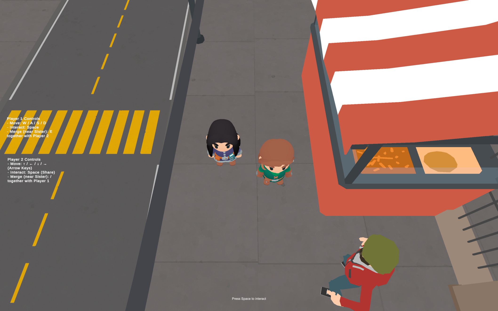
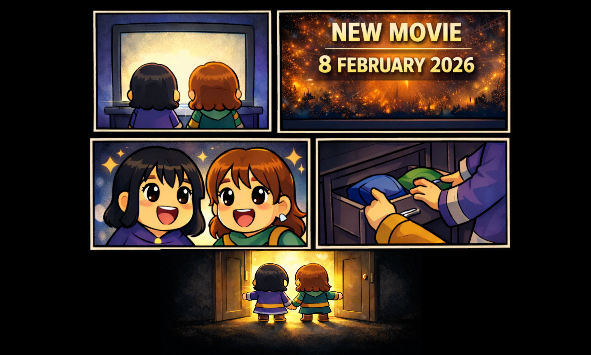
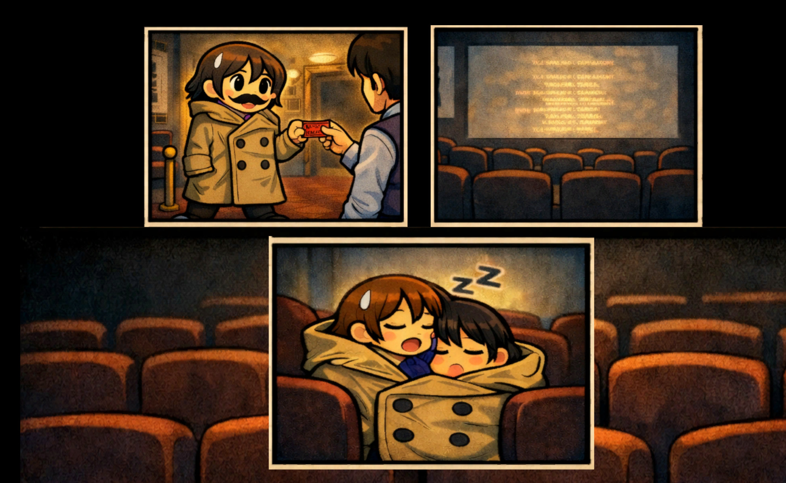
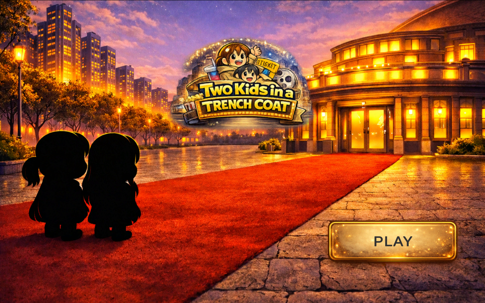
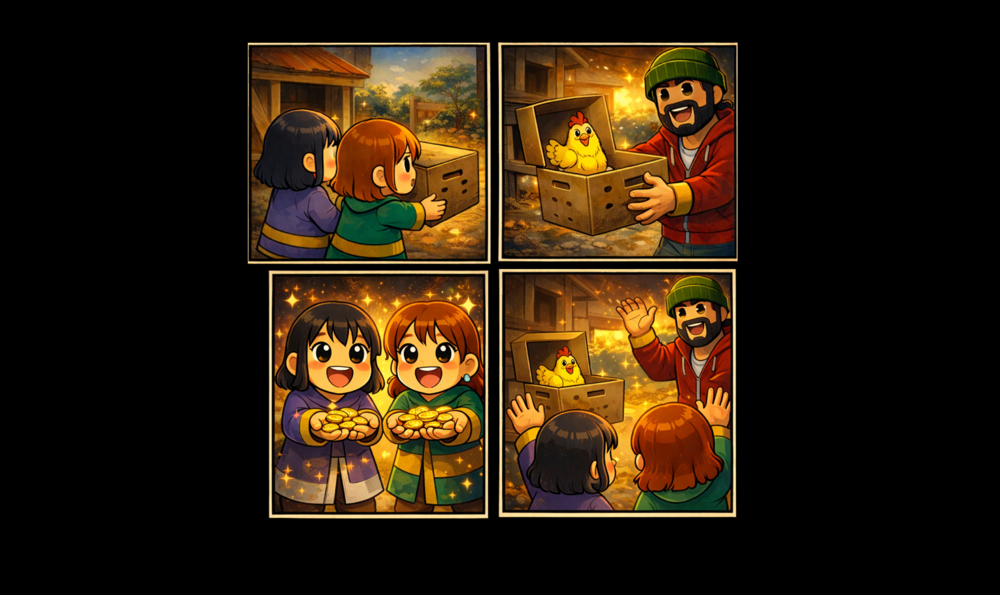

# GGJ2026 - Unity Co-op Game

A cooperative two-player game created for Global Game Jam 2026, featuring unique dual-perspective gameplay mechanics where players can switch between top-down and first-person split-screen views.

## Screenshots

| Screenshot 1 | Screenshot 2 |
|:------------:|:------------:|
|  |  |

| Screenshot 3 | Screenshot 4 |
|:------------:|:------------:|
|  |  |

| Screenshot 5 |
|:------------:|
|  |

## Game Overview

This is a cooperative multiplayer game where two players must work together to achieve their objectives while navigating a city environment filled with obstacles, animals, and interactive objects. The unique view-switching mechanic allows players to merge into a first-person perspective or separate into independent top-down characters.

## Key Features

### Dual View System
- **Top-Down Mode**: Both players control separate characters independently with full visibility of the environment
- **First-Person Mode**: Players merge together into a split-screen first-person view for coordinated navigation
- Seamless switching between perspectives with visual and audio feedback

### Two-Player Controls

#### Player 1 (Top-Down)
- **Movement**: WASD keys
- **Sprint**: Left Shift

#### Player 2 (Top-Down)
- **Movement**: Arrow Keys
- **Sprint**: Right Shift

#### First-Person Mode
- **Top Camera**: A/D for rotation
- **Bottom Camera**: Arrow keys for rotation
- Both players share movement control in merged mode

### Game Elements

#### NPCs and Animals
- **Dogs**: Will chase players if detected; avoid getting caught or trigger game over
- **Cats**: Flee from players; can be herded toward objectives
- **Guards**: Patrol areas and may react to player presence
- **Running People**: Dynamic crowd elements that add life to the city

#### Interactions
- Interactable objects throughout the environment
- Car traffic system with collision detection
- City obstacles including buildings, parks, and factories
- Collectible items (e.g., bananas)

### Environment
- Urban city setting with multiple themed areas:
  - Residential districts
  - Parks
  - Factories
  - Broken roads and obstacles
- Dynamic traffic system with various vehicles
- Environmental objects like electricity posts and decorative elements

## Technical Features

### Player System
- Custom 3D top-down controller with physics-based movement
- Character animation support with walking states
- Event system for walking start/stop
- Configurable movement speed and sprint multiplier
- Smooth rotation toward movement direction
- Ground detection and gravity system

### Camera System
- Intelligent top-down camera that follows both players
- Split-screen first-person cameras (top and bottom)
- Smooth transitions between view modes
- Camera borders to keep players in view

### Audio System
- Walking sound effects (adult and child footsteps)
- Background adventure music
- Ambient traffic sounds
- Character interaction sounds (chick, mumble)
- Merge/split audio feedback
- Coin collection sounds

### Game Management
- Scene transition system with loading screens
- Progress tracking
- Timer system
- Game over handling
- Menu system
- Story progression

## Project Structure

```
Assets/
├── Animation/          # Character animations
├── Audio/              # Sound effects and music
├── Images/             # UI graphics and screenshots
├── Models/             # 3D models (vehicles, buildings, characters)
├── Scenes/             # Game levels
│   ├── Menu.unity
│   ├── Level1.unity
│   ├── Level2.unity
│   └── Level3.unity
├── Scripts/            # C# game logic
│   ├── TopDownPlayer3D.cs
│   ├── SimpleFPPController.cs
│   ├── ViewSwitchManager.cs
│   ├── GameManager.cs
│   ├── DogController.cs
│   ├── CatController.cs
│   ├── CarController.cs
│   └── ...
├── Prefabs/            # Reusable game objects
│   ├── Players
│   ├── Cameras
│   ├── Vehicles
│   └── Audios
└── Settings/           # Unity project settings
```

## Core Scripts (AI)

### Player Controllers
- **TopDownPlayer3D.cs**: Handles top-down player movement with WASD/Arrow keys
- **SimpleFPPController.cs**: First-person controller for merged mode
- **PlayerAnimatorController.cs**: Manages character animations
- **PlayerInteraction.cs**: Handles object interaction

### Managers
- **GameManager.cs**: Singleton managing game state and scene transitions
- **ViewSwitchManager.cs**: Controls switching between top-down and FPP modes
- **TimerController.cs**: Game timer functionality
- **MenuController.cs**: Main menu and UI navigation
- **StoryController.cs**: Narrative progression

### AI Controllers
- **DogController.cs**: Dog chase AI with detection and follow behavior
- **CatController.cs**: Cat flee behavior and herding mechanics
- **GuardController.cs**: Guard patrol and detection
- **PeopleRunning.cs**: Crowd movement simulation

### Environment
- **CarController.cs**: Vehicle movement and traffic simulation
- **CarHit.cs**: Collision detection for vehicles
- **InteractableObject.cs**: Base class for interactive objects
- **Trap.cs**: Hazard mechanics

## Requirements

- **Unity Version**: 2022.3 or later (recommended)
- **Input System**: New Unity Input System package
- **Platform**: PC (Windows/Mac/Linux)
- **Players**: 2 (local co-op on same keyboard)

## How to Build

1. Open the project in Unity
2. Go to `File > Build Settings`
3. Add all scenes from `Assets/Scenes/` to the build
4. Select your target platform
5. Click `Build` and choose output directory

## How to Play

1. Launch the game
2. Start from the menu
3. Player 1 uses WASD, Player 2 uses Arrow Keys
4. Work together to complete level objectives
5. Switch between views as needed for different challenges
6. Avoid dogs and hazards
7. Complete all levels to win!

## Development Team

Created for Global Game Jam 2026

## Credits

### Assets
- Vehicle models from various asset packs (Unity Asset)
- City environment elements (Unity Asset)
- Character models and animations (Unity Asset)
- Cutscenes/Background (AI)

### Audio
- Adventure music
- Sound effects for walking, interactions, and ambience
- Vehicle sounds

## License

This project was created for Global Game Jam 2026. Please refer to the jam's guidelines for usage and distribution.

---

**Note**: This is a game jam project created within a limited timeframe. Some features may be experimental or in prototype state.
